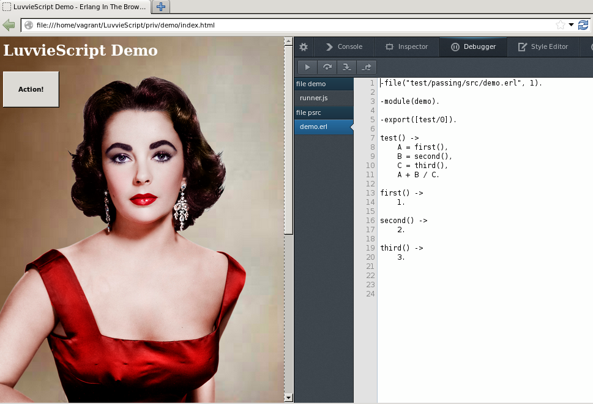



  

    <h1>Hey JS/Node Developers!</h1>
    
Did you know that Erlang was a big influence on the design of Node.js?
    

    
LuvvieScript is a compile-to-JavaScript dialect of Erlang that runs in the browser. It is a small but interesting early-stage project that will challenge preconceptions about how one should structure large JavaScript applcations. Exploring LuvvieScript will provide <a href="http://luvv.ie/mission.html">deep insight</a> into different ways to think about Javascript apps.
    

    
It's an open source project, so feel free to <a href="http://luvv.ie/install.html">install LuvvieScript</a> join us and
    <a href="http://luvv.ie/getting-started.html">get started</a>!
    Don't worry, you don't need to be an Erlang guru :-) You can jump right in and see how we are
    <a href="http://luvv.ie/toolchain.html">transpiling Erlang to JavaScript</a>.
    

  

  
  

    <h1>Erlang In The Browser</h1>
    
LuvvieScript is designed to deliver the simplicity of Erlang's message passing and pattern-matching paradigm to the developers of large scale web systems. LuvvieScript is a front-end langauge that works seamlessly with high-availability Erlang server clusters for fast and powerful web development. LuvvieScript is perfectly suited for DevOps and environments concerned with continuous integration/continuous deployment.
    

  

