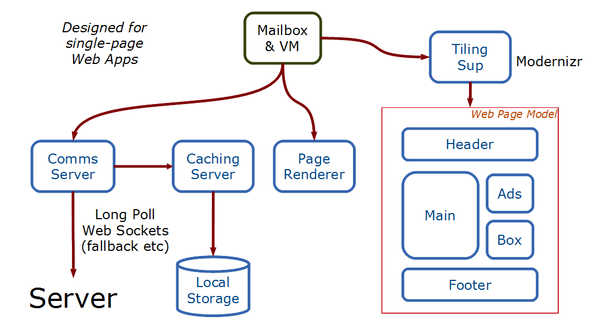
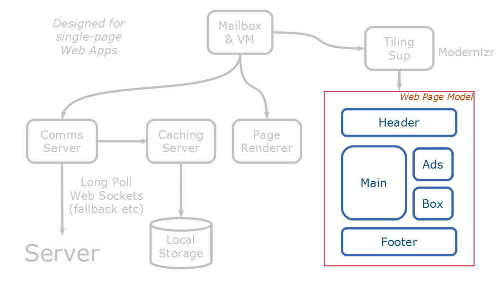
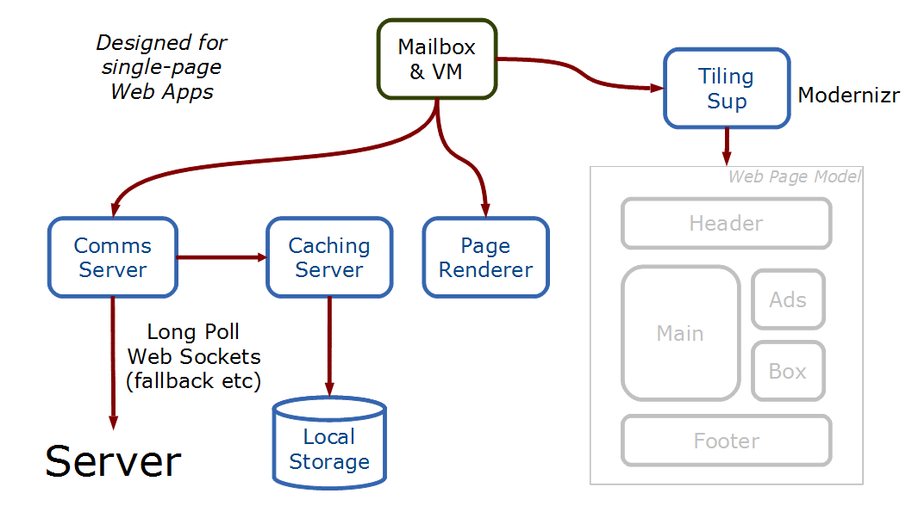



Why LuvvieScript?
=================

The rise of DevOps and Continuous Delivery as state-of-the-art development approaches is driving low-impedance programming, where small teams of developers are able to take end-to-end changes and incrementally deliver them into production, because the number of language/skills layers in the stack has been dramatically reduced.

Most low-impedance stacks are binary stacks with Javascript or CoffeeScript in the browser and some server-side language on the back - but there are a couple of uni-stacks:
* ``NodeJs``
* ``ClojureScript & Clojure``

The mission is to make ``LuvvieScript & Erlang/OTP`` a low-impedance enviroment for developing web apps.

What Is LuvvieScript?
=====================

LuvvieScript is defined by its mission. LuvvieScript is:
* a dom scripting language in the style of OTP Servers
* a strict sub-set of Erlang capable of running client and server side

LuvvieScript is **not**:
* a general purpose language
* an implementation of the Erlang VM in the browser

The reason LuvvieScript does not aspire to be ***Erlang VM In The Browser*** follows from the very different operating environments client- and server-side.

Client Side Operating Environment
---------------------------------

The client-side of a web application has the following characteristics:

* low concurrency (approx 9 units of concurrency)
* heavy-weight currency by Web Workers
* no shared code between concurrent processes
* code change by page refresh
* little supervision
* restart in the hands of the user not the programmer

Server-Side Operating Environment
---------------------------------

The server-side operating environment has the following characteristics:

* high concurrency (tens of thousands of concurrent processes)
* light weight concurrency by Erlang processes
* shared code via the Erlang VM and code loader
* hot swapping and code management
* OTP supervision and restart

The LuvvieScript Run-Time Environment
=====================================

The working design for the LuvvieScript run-time is shown below:


Different components of this view can be described as *-alities* - things that are specific to a particular application (the functionality of it) and *-ilities* attributes that are held in common across all applications. In normal Erlang developement the VM, Erlang/OTP Supervision and server behaviours provide the -iliites (reliability, scalability, performability etc, etc) whereas the programmer delivers the -alities by writing (mostly) ``gen_server`` workers.

The LuvvieScript programmer writes the ``dom_servers`` that manipulate the ***models*** of the webpage as shown below:


The intention is that the front end developer will write ``gen_server`` like code, all calls and casts:
```erlang
handle_call(Msg, From, State) ->
    {NewState, SideEffects} = manipulate_state(Msg, State),
    NewState2 = handle_side_effects(SideEffects, State),
    Reply = `whatevs`,
    {reply, Reply, NewState2};
```

The messages themselves will normalise events:

    msg_from_dom
    msg_from_server
    msg_from_other_web_worker

The other components provide all the *-ilities*:
* reliability
* cross-browser compatibility
* cachability
* etc, etc

These are shown below:


The ***Mailbox And VM*** is runs the inter-process mailbox. The actual job of rendering the page is handed off to the page rendering code. The intention is that the majority of the code in this part will be well tested javascript libraries with a message passing wrapper.

The browser will ***not*** be considered part of the server-side cluster - but rather something more losely connected - you could think of it as a bit like a C Port - you can communicate with it by sending and receiving messages as if it were a full node - but you can't do RPC calls to it. There will be a server side cowboy handler implemented as part of LuvvieScript
